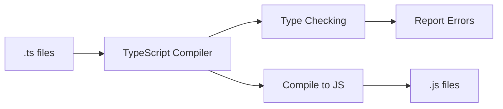
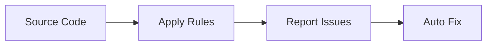
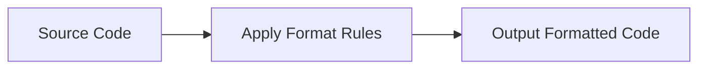
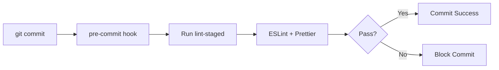

# Hướng dẫn sử dụng Code Quality Tools cho QA Team

## 📋 Mục lục

1. [Giới thiệu tổng quan](#giới-thiệu-tổng-quan)
2. [Các công cụ Code Quality](#các-công-cụ-code-quality)
3. [Tại sao cần Code Quality Tools](#tại-sao-cần-code-quality-tools)
4. [Cách hoạt động của từng công cụ](#cách-hoạt-động-của-từng-công-cụ)
5. [Hướng dẫn sử dụng Scripts](#hướng-dẫn-sử-dụng-scripts)
6. [Xử lý lỗi thường gặp](#xử-lý-lỗi-thường-gặp)
7. [Workflow hàng ngày](#workflow-hàng-ngày)

---

## 🎯 Giới thiệu tổng quan

Code Quality Tools là một bộ công cụ tự động giúp đảm bảo chất lượng code trong dự án Playwright.
Các công cụ này giúp:

- **Tự động kiểm tra lỗi code** trước khi commit
- **Thống nhất style code** trong toàn team
- **Phát hiện bugs** tiềm ẩn sớm
- **Đảm bảo code tuân thủ** best practices

---

## 🛠 Các công cụ Code Quality

### 1. **TypeScript**

- **Là gì**: Ngôn ngữ lập trình mở rộng của JavaScript, có thêm type system
- **Vai trò**: Kiểm tra kiểu dữ liệu, phát hiện lỗi compile-time

### 2. **ESLint**

- **Là gì**: Công cụ phân tích code tĩnh để tìm lỗi và đảm bảo coding standards
- **Vai trò**: Kiểm tra lỗi logic, style, security issues

### 3. **Prettier**

- **Là gì**: Code formatter tự động format code theo style chuẩn
- **Vai trò**: Đảm bảo code có format nhất quán

### 4. **Husky**

- **Là gì**: Tool quản lý Git hooks
- **Vai trò**: Chạy tự động các kiểm tra trước khi commit/push

### 5. **Lint-staged**

- **Là gì**: Tool chỉ chạy linting trên files đã được staged
- **Vai trò**: Tối ưu thời gian bằng cách chỉ check những file thay đổi

---

## 🤔 Tại sao cần Code Quality Tools?

### Đối với QA Team:

#### 1. **Giảm Bug**

```typescript
// ❌ Code không có type checking
const user = getUser();
user.email.toLowerCase(); // Có thể gây crash nếu email = null

// ✅ Code có TypeScript
const user: User | null = getUser();
user?.email?.toLowerCase(); // An toàn hơn
```

#### 2. **Dễ đọc và maintain Test Code**

```typescript
// ❌ Code không format
const locator = page.locator(selector.btn.submit);
await locator.click();

// ✅ Code được Prettier format
const locator = page.locator(selector.btn.submit);
await locator.click();
```

#### 3. **Tăng hiệu quả Review Code**

- Code đồng nhất → dễ review
- Ít lỗi cơ bản → focus vào logic
- Tự động fix nhiều vấn đề

#### 4. **Giảm thời gian Debug**

- Phát hiện lỗi sớm (compile time thay vì runtime)
- Lỗi được highlight ngay trong VS Code
- Suggestion fix tự động

---

## ⚙️ Cách hoạt động của từng công cụ

### TypeScript Compiler



### ESLint Process



### Prettier Process



### Husky Git Hooks



---

## 📝 Hướng dẫn sử dụng Scripts

> **Lưu ý quan trọng:** Các scripts dưới đây là custom scripts được định nghĩa trong `package.json` của dự án Playwright của bạn. Chúng chỉ hoạt động sau khi bạn đã setup Code Quality Tools theo hướng dẫn trong project setup. Đây KHÔNG phải là lệnh built-in của pnpm.

### Scripts cơ bản trong `package.json`:

#### 1. **Kiểm tra và sửa lỗi**

```bash
# Kiểm tra lỗi ESLint (không sửa)
pnpm lint:check

# Sửa lỗi ESLint tự động
pnpm lint

# Kiểm tra format Prettier (không sửa)
pnpm format:check

# Format code với Prettier
pnpm format

# Kiểm tra TypeScript compile
pnpm type-check
```

#### 2. **Scripts tổng hợp**

```bash
# Kiểm tra tất cả (lint + format + type)
pnpm quality:check

# Sửa tất cả vấn đề có thể auto-fix
pnpm quality:fix

# Chạy pre-commit check thủ công
pnpm pre-commit
```

---

## 🚨 Xử lý lỗi thường gặp

### Lỗi ESLint

#### **Lỗi: Unused variable**

```typescript
// ❌ Lỗi
const page = await context.newPage();
const submitBtn = page.locator(selector.btn.submit);
// Variable 'submitBtn' is assigned but never used

// ✅ Fix 1: Sử dụng variable
const locator = page.locator("#button");
await locator.click();
```

**Cách fix**:

```bash
pnpm lint  # Tự động fix nhiều lỗi
```

#### **Lỗi: no-console**

```typescript
// ❌ Lỗi
console.log("Debug info");

// ✅ Fix: Xóa hoặc comment
// console.log('Debug info');
```

#### **Lỗi: Prefer const**

```typescript
// ❌ Lỗi
let userName = "test@example.com";

// ✅ Fix
const userName = "test@example.com";
```

### Lỗi TypeScript

#### **Lỗi: Type không match**

```typescript
// ❌ Lỗi
const count: number = "abc"; // Type 'string' is not assignable to type 'number'

// ✅ Fix
const count: number = 123;
```

#### **Lỗi: Property không tồn tại**

```typescript
// ❌ Lỗi
const user = { name: "John" };
console.log(user.email); // Property 'email' does not exist

// ✅ Fix 1: Sử dụng optional chaining
console.log(user.email?.toLowerCase());

// ✅ Fix 2: Define proper type
interface User {
  name: string;
  email?: string;
}
const user: User = { name: "John" };
```

### Lỗi Prettier

**Prettier thường auto-fix được, nhưng nếu có conflict:**

```bash
# Fix formatting issues
pnpm format

# Nếu có conflict với ESLint
pnpm quality:fix
```

### Lỗi Husky

#### **Lỗi: Husky hooks không chạy**

```bash
# Re-install husky
pnpm husky install

# Check permissions
chmod +x .husky/pre-commit
chmod +x .husky/pre-push
```

#### **Lỗi: Pre-commit hook fail**

```bash
# Xem lỗi chi tiết
pnpm quality:check

# Fix theo từng bước
pnpm lint        # Fix ESLint errors
pnpm format      # Fix Prettier issues
pnpm type-check  # Fix TypeScript errors

# Sau đó commit lại
git commit -m "Fix code quality issues"
```

---

## 🔄 Workflow hàng ngày

### 1. **Trước khi bắt đầu coding**

```bash
# Pull latest code
git pull origin main

# Check current quality status
pnpm quality:check
```

### 2. **Trong quá trình coding**

#### VS Code sẽ tự động:

- Highlight lỗi ESLint bằng đường gạch đỏ
- Format code khi save (nếu đã setup)
- Show TypeScript errors

#### Manual check:

```bash
# Check nhanh file đang làm việc
pnpm lint:check src/tests/new-feature.spec.ts
```

### 3. **Trước khi commit**

#### Tự động (nhờ Husky):

```bash
git add .
git commit -m "Add new test cases"
# Husky sẽ tự động chạy lint + format
```

#### Manual (nếu muốn check trước):

```bash
# Check everything
pnpm quality:check

# Hoặc chỉ check staged files
pnpm pre-commit
```

### 4. **Khi có lỗi**

#### Step-by-step fix:

```bash
# 1. Fix ESLint errors
pnpm lint

# 2. Format code
pnpm format

# 3. Check TypeScript
pnpm type-check

# 4. Verify everything OK
pnpm quality:check

# 5. Commit again
git add .
git commit -m "Fix code quality issues"
```

---

## 🎯 Tips cho QA Team

### 1. **Setup VS Code đúng cách**

- Install extension: ESLint, Prettier, Playwright
- Enable format on save
- Enable ESLint auto fix on save

### 2. **Hiểu các cảnh báo**

```typescript
// Warning: có thể ignore tạm thời nhưng nên fix
/* eslint-disable-next-line no-console */
console.log("Temporary debug");

// Error: bắt buộc phải fix mới commit được
const user = getUser(); // Missing type annotation
```

### 3. **Best Practices**

- Commit nhỏ, thường xuyên
- Fix quality issues ngay khi xuất hiện
- Không bypass quality checks trừ trường hợp đặc biệt
- Hỏi team nếu không chắc cách fix

---

## 📞 Hỗ trợ và Resources

### Khi cần hỗ trợ:

1. Check file này trước
2. Chạy `pnpm quality:check` để xem lỗi cụ thể
3. Google error message
4. Hỏi team lead hoặc senior dev

### Resources hữu ích:

- [ESLint Rules](https://eslint.org/docs/rules/)
- [Prettier Options](https://prettier.io/docs/en/options.html)
- [TypeScript Handbook](https://www.typescriptlang.org/docs/)
- [Playwright Best Practices](https://playwright.dev/docs/best-practices)

---

## 📊 Monitoring Quality

### Quality Metrics để theo dõi:

- Số lỗi ESLint giảm dần theo thời gian
- Thời gian review code giảm
- Số bug production liên quan đến type errors giảm
- Team velocity tăng (do ít debug hơn)

### Weekly Review:

```bash
# Check quality trend
pnpm quality:check | tee quality-report.txt
```

---
